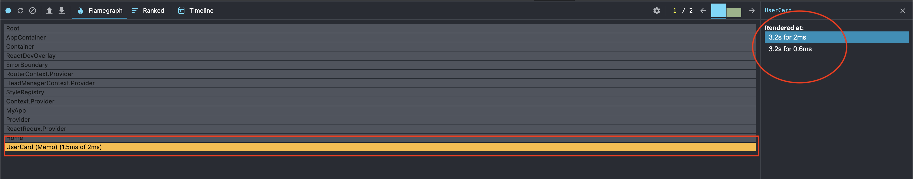

Earlier in [this](../a-simple-next-js-application-using-redux-toolkit-and-typescript-with-a-proposal-folder-structure) article, we set up a simple application using Next.js, react-toolkit and typescript as well as an example and usable folder structure. Since the post went long as crazy, I decided to divide the post into two parts.

The first part as just mentioned above was set up a small project.

So, the second part will be about measuring the rendering performance of the [previously created project](https://github.com/sulhadin/nextjs-typescript-redux-toolkit) using Profiler and give some tips about preventing unnecessary renders.

## React Profiler

If you are not already familiar with the famous profiler see [here](https://reactjs.org/blog/2018/09/10/introducing-the-react-profiler.html). Or leave me comment for another post about it!

See we got our first report about what happens after we press on `Change It!` button.


Everything looks perfect and the component is rendered one time as expected. This is a whole different topic and we are not going to dive right into the middle of the ocean. So, roughly mentioning, what happens when we do not need and call a state that has been changed in a mounted component?

Let’s rewind catch what was extra in our code snippets above. In the default state defined in `userSlice.ts:11` we have an extra `email` field;

```typescript
const initialState: UserState = {  
  name: 'Sulhadin',  
  email: 'sulhadin@gmail.com'
} as const;
```

In the `UserCard.tsx:14`, we called `email` field from `useSelector`,

```typescript
const { name, email } = useSelector(getUserState);
```

And finally at `UserCard.tsx:19`, we have the following as commented;

```typescript
// dispatch(setEmail(‘sulhadin@hotmail.com’));
```

## Case 1
* Leave everything as it is and run the profiler

You will see `UserCard.tsx ` is rendered 1 time.


## Case 2

* Revert the comment line at `UserCard.tsx:19`
* Make sure two actions are dispatched after one another.

You will see `UserCard.tsx` is rendered 2 times.



## Case 3
* Apply Case 2 again.
* Remove `email` field from `useSelector` at `UserCard.tsx:14`!!!

You will see `UserCard.tsx` is rendered 2 times although we destruct only `name` field from `useSelector`. In other words we get just `name` state from redux.


That is surprising, because we use `name` alone, but we dispatch both `useName` and `useEmail` . Does it make difference? We do not get `email` field from redux, but why `useSelector` triggers the component 2 times?

# How and why?
`name` and `email` are located in the same redux `slice`. So, any single of those states changes, it does not make any difference, `useSelector` observes the change in the reducer and triggers the render regardless of how many states we get from the selector in a component.

Let’s elaborate the issue with an explicit example!

```tsx
import React, { memo } from 'react';
import { Button, Typography } from '@mui/material';

import { useDispatch, useSelector } from '../../store/store';
import { getUserState, setEmail, setName } from '../../store/slices/userSlice';
import styles from '../../styles/Home.module.css';

/**
 * A simple User card that only displays a given state.
 *  
 * @constructor
 */
function UserCard() {
  const dispatch = useDispatch();
  const { name } = useSelector(getUserState);

  const onClick = () => {
    setTimeout(() => {
      dispatch(setName('Öney'));
      dispatch(setEmail('sulhadin@hotmail.com'));
    }, 2000);
  };

  return (
    <>
      <Typography variant="h1" component="h2">
        Hi <>{name}</>
      </Typography>

      <p className={styles.description}>
        <code className={styles.code}>Something is wrong I can feel it!</code>
        <Button onClick={onClick}>Change it!</Button>
      </p>
    </>
  );
}

export default memo(UserCard);
```

Most of the code here is identical to what we saw in `UserCard.tsx`. Simple flow of this code as you can see is getting the `name` state from state management and rendering it. As simple as it looks! After clicking on the `Change it!` button, It dispatches two actions `setName` and `setEmail` which modify different states in the same reducer. Since those states are being modified, the component is being rendered two times even if we do not use `email` state.

# How to handle this extra rendering?
To understand this problem, you should understand how actually `useSelector` works. Let’s look a bit into it.

`useSelector` has two arguments `(selector: Function, equalityFn?: Function)`. In above example argument `selector` is `getUserState` which stands for whole state object which is `user`.

```typescript
export const getUserState = (state: { user: UserState }) => state.user;
```

`useSelector` observes the object returning from selector function and detect the change, therefore, it triggers the rendering operation.

## Here a couple of tricks that prevents extra rendering!
* Return only needed states from `selector` function argument.

```typescript
// E.g.
import { useSelector } from 'react-redux';
const name = useSelector((state: { user: UserState }) => state.user.name);
```

By doing so, `useSelector` will only observer `name` and triggers the rendering operation when necessary.

* Apply separation of concern from SOLID as much as possible to your components (e.g. Try to create different components that use different states).
* If only the reference of some of your values are changed but not the data itself, you can use `shallowEqual` function as the second argument of `useSelector`

````typescript
// E.g.
import { useSelector, shallowEqual } from 'react-redux';

const name = useSelector((state: { user: UserState }) => 
state.user.name, shallowEqual);
````

By doing so, you can create a comparison capability before doing anything wrong!

As much as playing with hooks is great, there might also be some side effect that might effect your project’s performance. Those functions are well-documented, and I recommend you to visit [https://react-redux.js.org](https://react-redux.js.org) also you can read [this great article](https://react-redux.js.org/api/hooks#useselector) from Redux-toolkit documentation about `useSelector`.

## In Closing

Thanks for reading.
