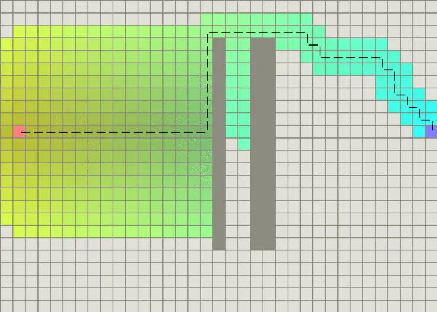

DO YOU KNOW HOW ROBOTS OR NPC (NON-PLAYER CHARACTERS) FIND THEIR TARGET IN A SHORTEST WAY EVEN IF THERE ARE LOTS OF OBSTACLES?

Can you solve basic algorithms? Do you think that you can solve finding shortest path among obstacles to target problem? If you are like most students in High schools of Turkey, probably not nearly you can! A great way to do this is to find a person who know how to do and love to teach you this solution or to follow this instructional unit document.

Finding shortest path from source to target which we will use A* algorithm (pronounced as A star) will help any student to walk through the complex algorithms. You will also have basic information about artificial intelligence in background, and how such system works. In computer programming world, A* enjoys widespread use due to its good performance and working accuracy. Although, in practical travel-routing systems, it is generally outperformed by algorithms which can perform better performance in some occasion, however, many has found A* to be superior to other approaches. This unit of instruction will be a guide for you to follow steps of A* and find shortest path between two points.

In this unit, you will better understand what kind of process is necessary to find your target, how to calculate and use variables needed. Finally, you will reach the target without getting tired.

Regardless of which programming language you are interested in, you will find this instructional unit helpful as it explains the algorithm in detail in text format. For those who use any programming language, after reading and applying this steps, they can use this algorithm and make their character genius!

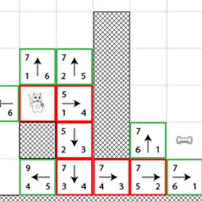

So, let's find the shortest path as if we find the refrigerator and open its door at night as we are asleep. Let's start!

## A Cat will find her path

Let's assume we have a big table where a cat named Pakize wants to get the bone. In real world, you might think that "why a cat would want a bone?". In our game, our Pakize is a little bit shrewd and wants to hide the bone so that dog cannot find it, and go away.

We placed Pakize randomly and so the bone. She is going to find the shortest path to the bone.

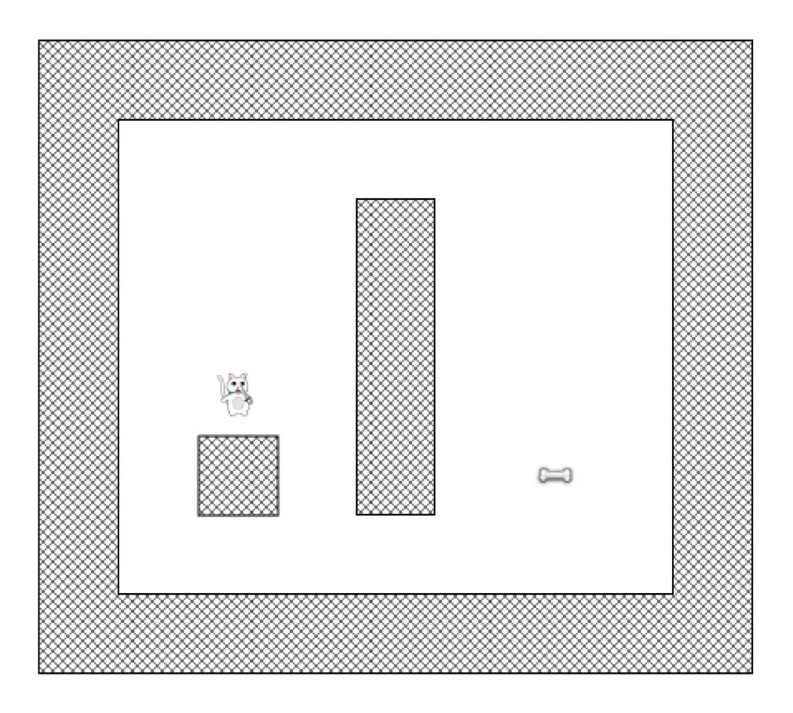

Unfortunately, Pakize cannot go straight from her current position to the bone, because there is an obstacle blocking her and obviously, she is not a ghost!

Pakize is like Garfield, she is so lazy to travel all around the table to find the bone, she seeks the shortest path to the bone.

Let's figure out that how we can write an algorithm for her to find shortest path she wants.

## Creating A Search Area

The first step of pathfinding is to generate an area dividing it into something easily manageable in our game. Best way to do this is to think about our game. There is a cat and she wants to get the bone, so, tile (square shape) is suitable for our game. We could also prepare in the shape of rectangle or other similar; however, square shape is best fit for our game.

Now we can divide our search area. Our search area can be represented by a two-dimensional array. So, let's say the level is a map of 40*40 tiles, our search area will be an array of 1600 squares. Let's see a picture of prepared simple example with 7x6 tiles = 42 tiles in total and put our cat Pakize somewhere.

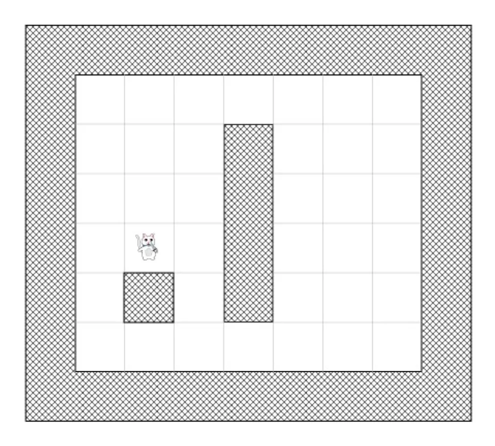

## The Open and Closed Lists

Well, we have created a search area, let's look at A* algorithm in detail and how it works.

By the way, did we tell you our cat did not have a good memory? If we do not, let's keep it in mind because our kitten will need two lists to remember:

* The squares we checked to find the nearest path (open list)
* The list that we have decided and will not change again (closed list)

Pakize will start by adding that momentary starting point, which we will call "A" to the closed list. Then, she will add 8 squares which are obviously her neighbors, around the current position to the open list. Here is an example of how the cat sees (green represents the open list):

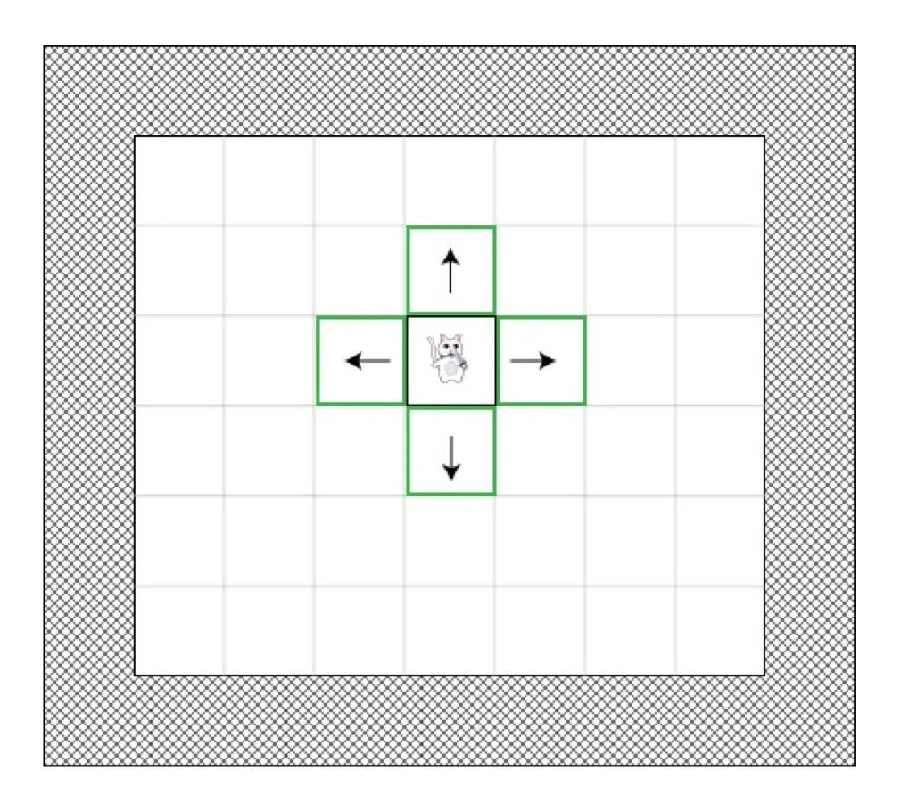

Now Pakize must determine which of these options is the shortest way, how can she choose?

Some calculations are made in the A* path algorithm, which is done by giving a point for each tile, this is called the path score. See how it works!

## Tile Scoring

We'll calculate for each square a score G, H and F where:

* **G** is the movement cost from the start point A to the current square. So, for a square neighbor to the start point A, this would be 1, but this will increase as we move away from the starting tile.
* **H** is heuristic estimated movement cost from the current square to the target point (we'll name this tile B). We must keep that in mind that it's just an estimation.
* **F** is equals to G + H. While we are traveling between tiles, we are going to check the F value.

You may be wondering what we mean by saying "movement cost". It's just the number of tiles that lead us to the B point which is our target.

### Talk More About G

We talked about G which is the movement cost (in number of tiles for this game) from the start point A to the current square.

To calculate G, we need to take the parent's G (the frame we came from) and add 1 to it. Thus, each tile's G will represent the total cost from the starting path, that is, point A to the current square.

For example, this example shows two ways to go to two tiles: The G points in each tile are listed in the tile:

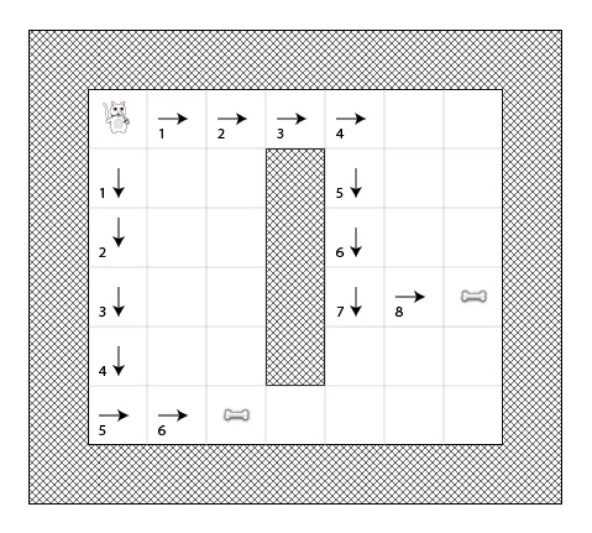

### Talk More About H

Remember that H is the estimated cost of movement (by the number of tiles in that game) to the B point.

The closer the estimated cost of movement is to the actual cost, the more accurate the final route will be. If the prediction is turned off, the path generated will not be the shortest (but likely near). This topic is very complex, so you should follow this article.

To put it in other words, we will just count the number of horizontal and vertical tiles remaining to target point B without considering of any obstacles.

For example, here is a picture that shows estimation of H from various starts points and destinations.

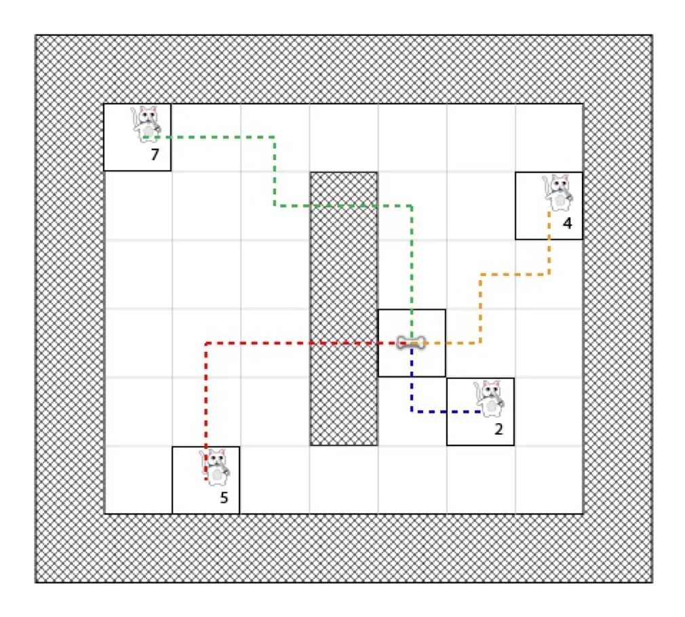

## Walking Through A* Algorithm

Now, you are expert at calculating the values of each tile. Let's see how the A* algorithm works.

Pakize will find the shortest path by repeating the following steps:

* Determine the neighbors and add them all to the open list after calculating its scores.
* Get the tile on the open list which has the lowest score F. Let's call this square W.
* Remove W from the open list and add W to the closed list.
* For each square T in W's walkable neighbors' tiles:
   - If T is in the closed list: Ignore it.
   - If T is not in the open list: Add it in the open list and compute its score.
   - If T is already in the open list: Check if the F score is lower when we use the current generated path to get there. If it is, update its score and update its parent as well.

I know that you are still a bit confused about how this works. Do not worry be happy, we'll walk through an example so you can see it working step by step!

## Pakize's Path

Let's play our game and take Pakize walking on the way to the bone.

In the pictures below, values `F = G + H` are listed as the following:

| Symbol | Description | Position |
|--------|-------------|----------|
| **F** | Score for checked square | Top left corner |
| **G** | Cost from A to checked square | Bottom left corner |
| **H** | Estimated cost from checked square to B | Bottom right corner |

Also, the arrow shows the possible movement direction to go to that square.

Finally, on each step the red squares indicate the closed list and the green squares indicate the open list.

Now we are excited!

### Step 1
In the first step, Pakize determines the walkable neighbor squares to its beginning position A, computes their F scores, and adds them to its open list:

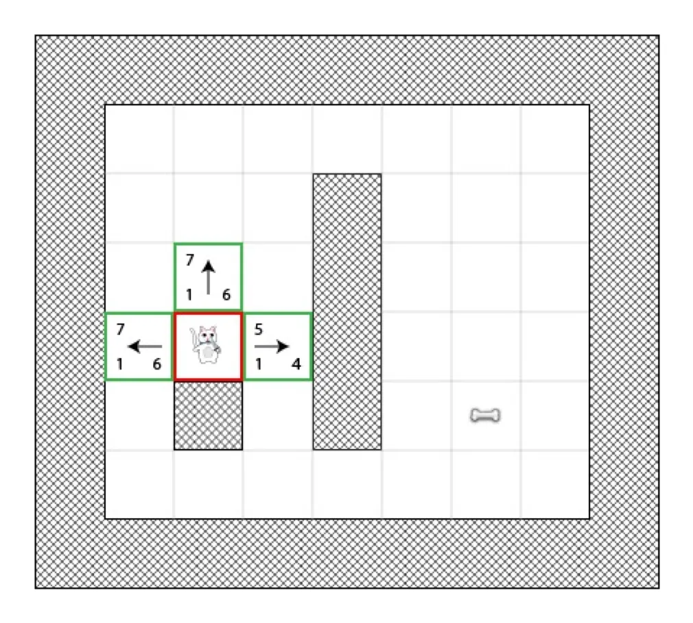

You can see that the H value is listed for each tile (two have 6 and one has 4). I recommend counting out the tiles per the distance to make sure you understand how that part works.

Also, note that the F value (on the upper left) is just the sum of G+H (lower left and lower right).

### Step 2
In the next step, Pakize chooses the tile with the lowest F score, adds that node to the closed list, and retrieves its neighbor squares.


So, you'll see here that the square with the lowest cost was the one that had F as 4. It tried to add any tile neighbor to this to open list (and calculate their score), except notice that it couldn't add the tile on which Pakize is (because it was already on the closed list) or the wall tile (because it wasn't available).

Notice for the two new tiles added to the open list, the G values are increased by one because they are 2 tiles away from the starting point. You might also like to count out the distance to make sure you understand the H values for each of the new tiles.

### Step 3
Again, we choose the tile with the lowest F score which is 5 in this area and continue to iterate:

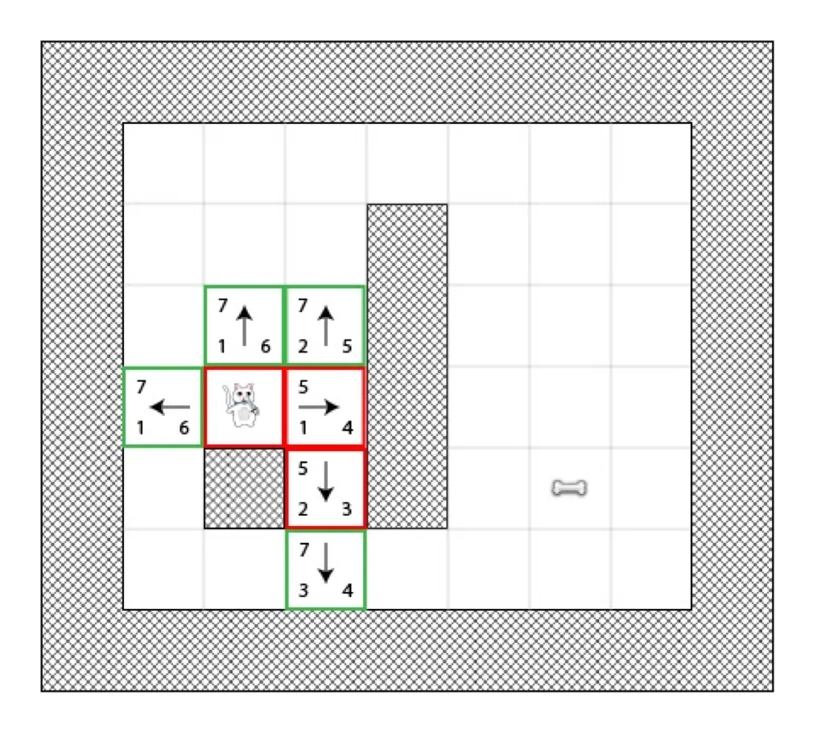

In this case, there is only one possible tile to add to the open list, because the other is already on the closed list and two are blocks (left and right).

### Step 4
Now we have an interesting case. As you can see in the previous picture, there are 4 tiles with the same F = 7 score on the open list.

What should we do!

There are several solutions we can use in this situation, but we will be applying one and the best solution: choosing the most recently added tile to the open list. So, continuing with the most recent tile we have:

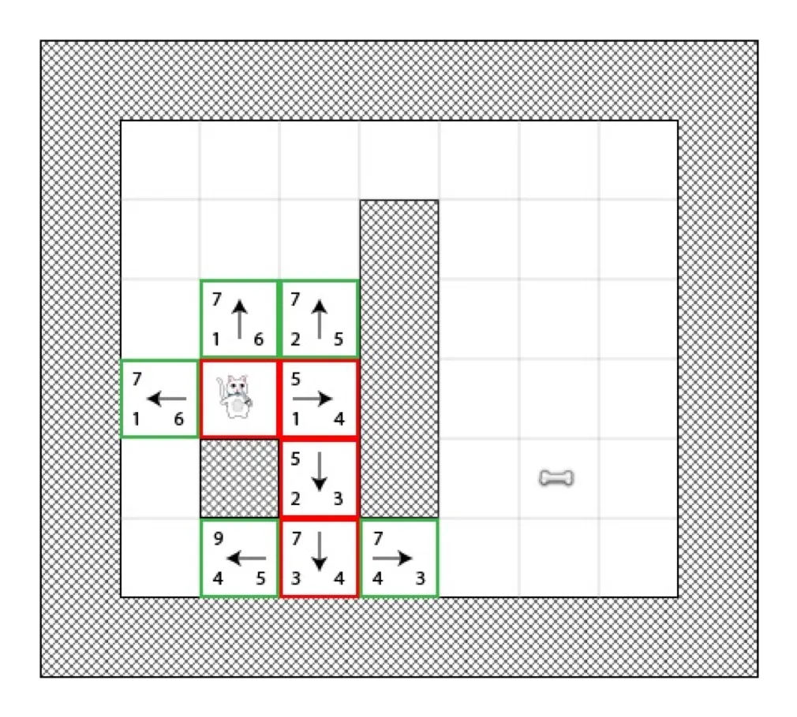

This time two tiles were neighbor and available, and we calculate their scores as usual.

### Step 5
Again, we choose the tile with the lowest score which is 7 here and in case of a confusion choose the most recent neighbor added on the open list:

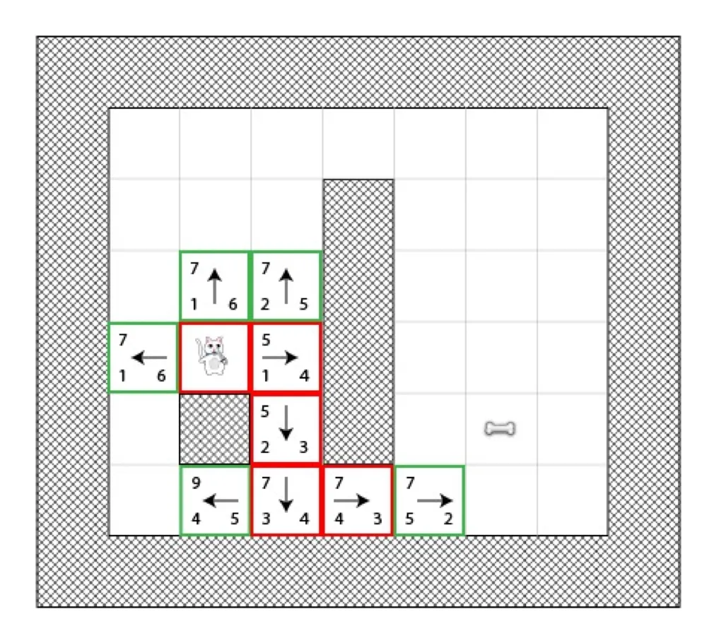

Just one possibility added to the closed list this time and we marked it as red. Our cat getting excited; because, she is about to find the bone!

### Step 6
You are amazing! I bet you can easily figure out the next step like the following:

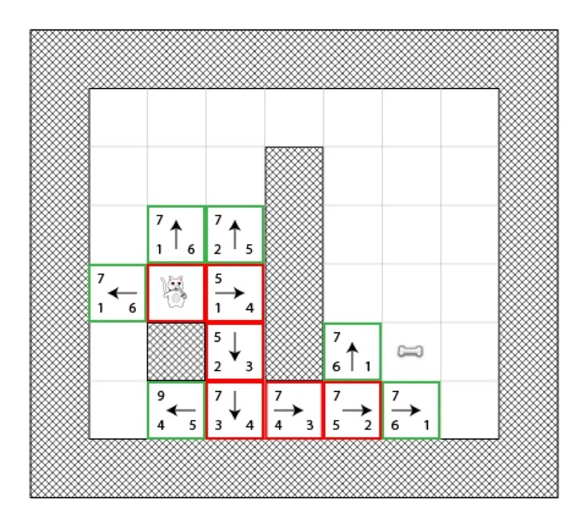

Pakize is almost there, but this time as you can see, she encountered with two similar shortest paths to the bone she could choose between:

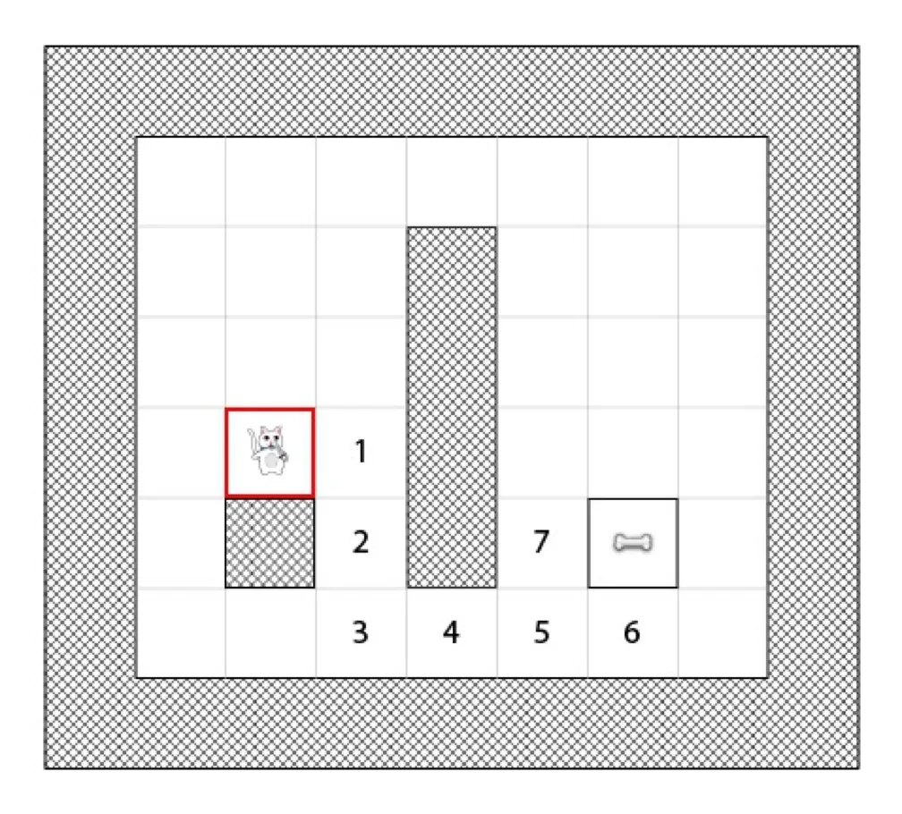

In our game, we have found two different shortest paths:

```quote
* 1–2–3–4–5–6
* 1–2–3–4–5–7
```
It doesn't matter which one of these tiles we choose.

### Step 7
Let's repeat the step one more time choosing one of these tiles:

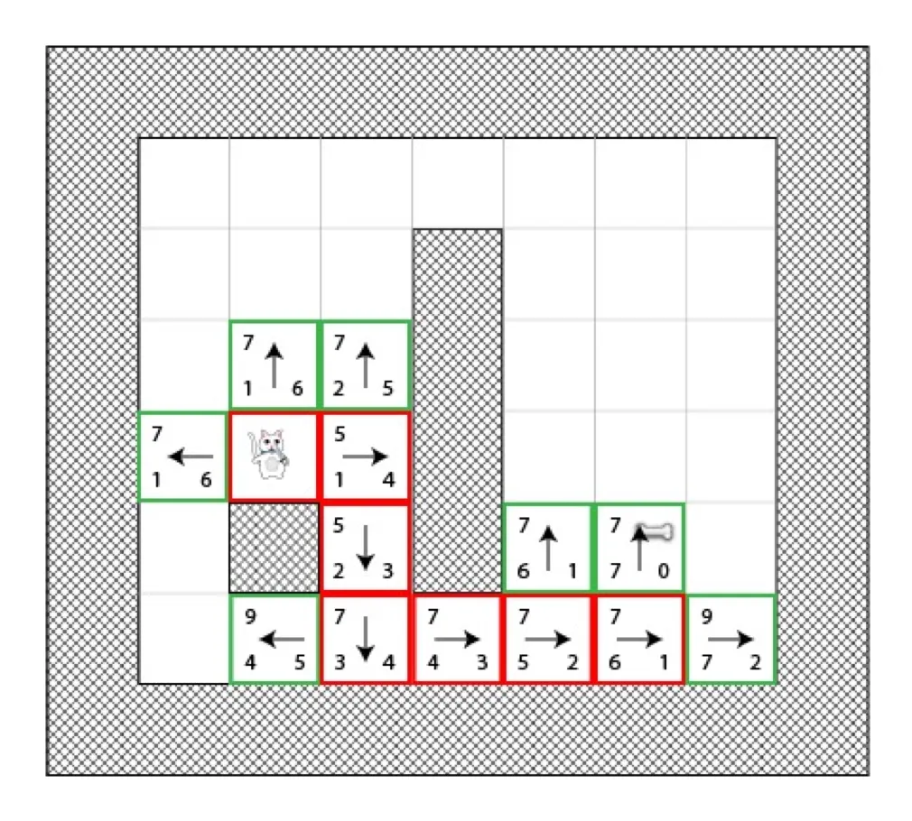

Pakize choose the left one and checked its neighbors and put them all in the open list.
In every time neighbors are added in the open list, Pakize should check the neighbors so that which one has the bone.

Aha, the bone is in the open list!

### Step 8
As we detected the target tile in the open list, we should add it into the closed list:

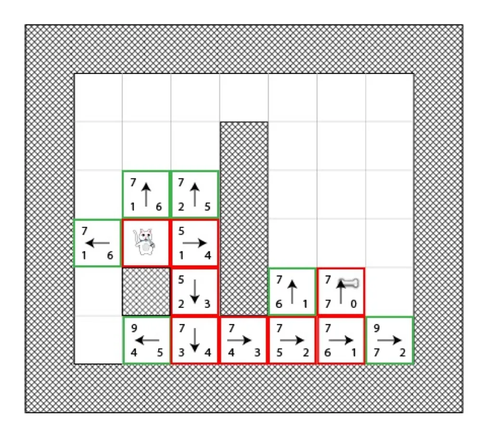

Finally, as we encaged the bone into the closed list, the is going to mark the tiles into the closed list as the closest path to our target.

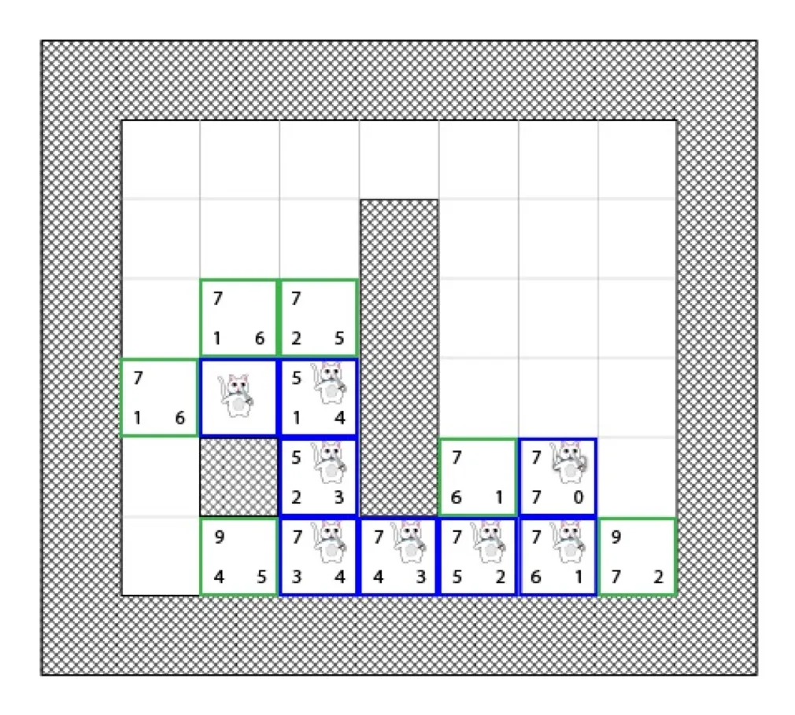

## An Intelligent Cat

In our example, we saw that our cat has found the shortest path; however, she could choose other tiles which Fvariables are the same. I started to think that Pakize is smart because she finds out which tile is closest to the bone!

If she had chosen other tiles, here is an example of how it would be:

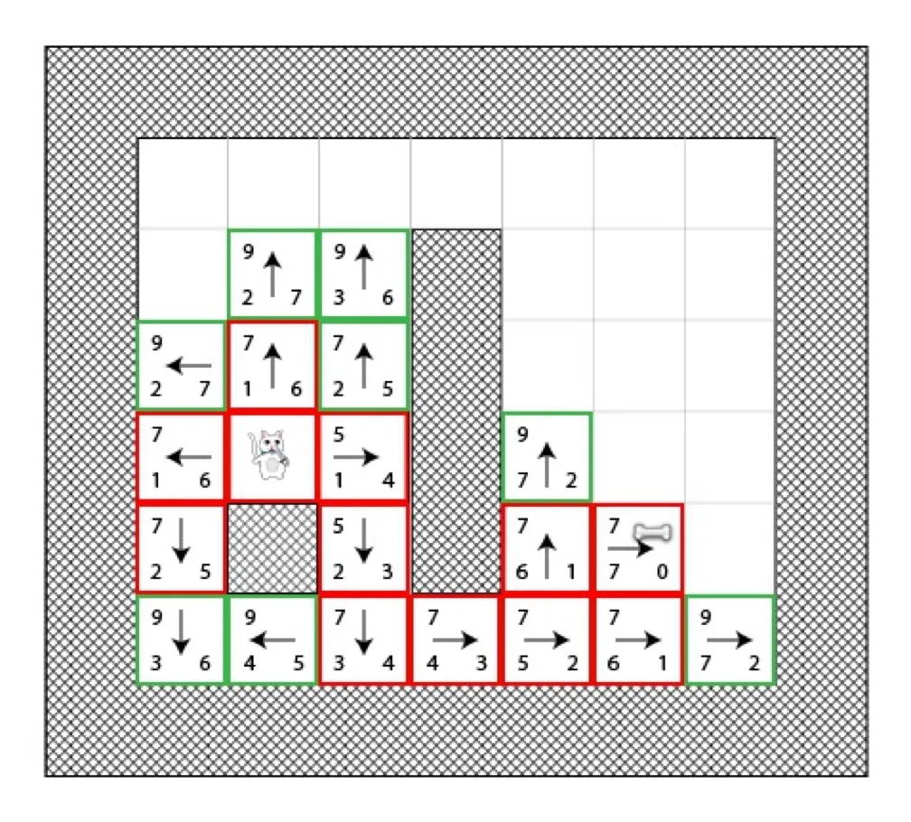

Here we would encounter with a different scenario which the red tiles do not represent the shortest path. They just represent the tiles that have been chosen as an "W" tile at some point.

Even if we find the bone, the tiles in the closed list does not fit the best and shortest way; however, if you track the line you will arrive the target eventually.

All in all, following wrong tiles is not a wrong decision, you will end up with the shortest path unless you miscalculate the variables even if it takes more time.

One last time, let's check our excellent algorithm!

* Neighbor tiles will be returned in that order: top / left / right / bottom.
* A tile will be added in the open list after all the tiles that have the same score (so the first added square will be the first picked by Pakize).

Here's a diagram:

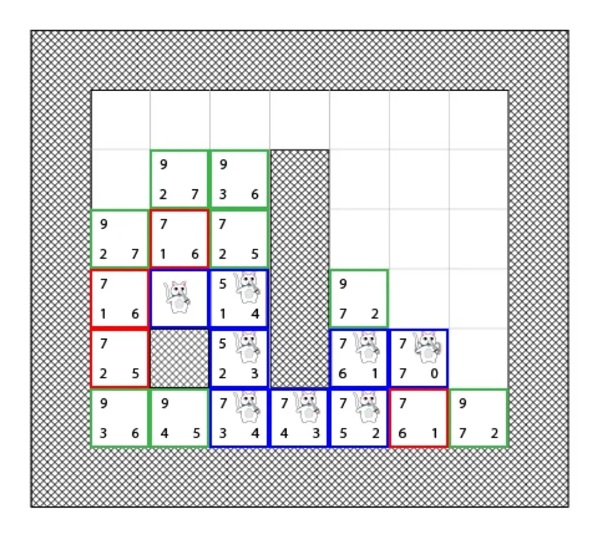

The shortest path is constructed by starting point to target point step by step by checking the F variables that are closest to the ultimate point.

## See It In Action

Want to see the A* algorithm in a real game? Check out my [Tank 1990](https://github.com/sulhadin/tank-1990) project on GitHub - a classic tank game where enemy tanks use A* pathfinding to hunt you down!
