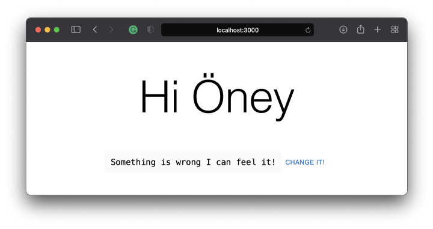

If you’ve been using React for a long time, you must have used State Manager. For many of us, Redux was considered a de facto state manager because it was as good as it promised to run the state. However, the problem was that I needed a lot of boilerplate code to get started with Redux, and even the simplest apps had a steep learning curve. These complaints were loudly clarified by the developer community, and the team behind Redux noticed them. Enter the Redux Toolkit …

> Opinionated, batteries-included toolset for efficient Redux development

---

## Let's start with a little bit of according to them…
Redux Toolkit was originally created to help address three common concerns about Redux:

* “Configuring a Redux store is too complicated”
* “I have to add a lot of packages to get Redux to do anything useful”
* “Redux requires too much boilerplate code”

Considering those points, we are introduced with the new state management as a big savior.

To make long story short, in this post, you are going to be introduced with a small [Next.js](https://nextjs.org/) implementation using [Redux-toolkit](https://redux-toolkit.js.org/) and [Typescript](https://www.typescriptlang.org/). 
Main focus would be Redux-toolkit and folder structure and rendering performance. 
This redux-toolkit implementation is going to work in both client-side and server-side rendering.

## Preparation
Running a project is as simple as writing a couple of cli commands.

* Execute [create-next-app](https://github.com/vercel/next.js/tree/canary/packages/create-next-app) with `npm` or `yarn`
* Once the installation is done, you can run your application using:

```bash
cd nextjs-blog

yarn run dev
#or
npm run dev
```

Once all the process is done, you should be able to see the app running on [http://localhost:3000/](http://localhost:3000/)

## Folder Structure — Trivia!
Folder standard is one of main issues in general. If you’ve worked at least in one project, you might be familiar with where-to-put-this-file issues. There is not a best practice for folder structure but it gets its shape as the project grows. Yet, it varies based on the javascript `framework` you use.

Initially, once you examine your folder structure, you will see the one below;

```
.
┣ 📂 node_modules
┣ 📂 public
┣ 📂 src
┃ ┗ 📂 pages
┃    ┣ 📂 api
┃    ┃  ┗ 📄 hello.ts
┃    ┣ 📄 _app.tsx
┃    ┣ 📄 _document.tsx
┃    ┗ 📄 index.tsx
┣ 📄 .gitignore
┣ 📄 yarn.lock
┗ 📄 package.json
```

The first move is to crating folder standards. The purpose of creating these standards; It is to prevent developers from applying different names and locations. Thus, we all want to ensure developers that we all at the same page and look in the same direction.

Here is a proposal folder structure which we think that might satisfy our needs in our example.

```
.
┣ 📂 node_modules
┣ 📂 public
┣ 📂 src
┃ ┣ 📂 pages
┃ ┃  ┣ 📂 api
┃ ┃  ┣ 📄 _app.tsx
┃ ┃  ┣ 📄 _document.tsx
┃ ┃  ┗ 📄 index.tsx
┃ ┣ 📂 store
┃ ┃  ┗ 📂 slices
┃ ┣ 📂 styles
┃ ┃  ┗ 📄 globals.css
┃ ┣ 📂 ui
┃ ┃  ┣ 📂 components
┃ ┃  ┗ 📂 home
┣ 📄 .gitignore
┣ 📄 yarn.lock
┗ 📄 package.json
```

* `pages` and `ui` tend to be linked.
* Folders will be added to `ui` as the pages are added in `pages` folder. (E.g., everything used in `pages/index.tsx` such as components, helpers will be put under `ui/home` folder.)
* `ui/components` will contain shared component.

Down the post, we are going to create `UserCard.tsx`, `store.ts`, `userSlice.ts` so our folder structure will become something like below.

```
.
┣ 📂 node_modules
┣ 📂 public
┣ 📂 src
┃ ┣ 📂 pages
┃ ┃  ┣ 📂 api
┃ ┃  ┣ 📄 _app.tsx
┃ ┃  ┣ 📄 _document.tsx
┃ ┃  ┗ 📄 index.tsx
┃ ┣ 📂 store
┃ ┃  ┣ 📂 slices
┃ ┃  ┃  ┗ 📄 userSlice.ts
┃ ┃  ┗ 📄 store.ts
┃ ┗ 📂 styles
┃ ┃  ┗ 📄 globals.css
┃ ┣ 📂 ui
┃ ┃  ┣ 📂 components
┃ ┃  ┗ 📂 Home
┃ ┃     ┗ 📄 UserCard.tsx
┣ 📄 .gitignore
┣ 📄 yarn.lock
┗ 📄 package.json
```

## Redux Toolkit
The Redux Toolkit is available as an NPM package.

```bash
# NPM
npm install @reduxjs/toolkit
# Yarn
yarn add @reduxjs/toolkit
```

After adding the package to your project, we can start configure our slice and store.

Let’s create a simple `store/slices/userSlice.ts` file.

```typescript
import { createSlice, Draft, PayloadAction } from '@reduxjs/toolkit';

export interface UserState {
  email: string;
  name: string;
}

/**
 * Default state object with initial values.
 */
const initialState: UserState = {
  name: 'Sulhadin',
  email: 'sulhadin@gmail.com',
} as const;

/**
 * Create a slice as a reducer containing actions.
 *
 * In this example actions are included in the slice. It is fine and can be
 * changed based on your needs.
 */
export const userSlice = createSlice({
  name: 'user',
  initialState,
  reducers: {
    setName: (
      state: Draft<typeof initialState>,
      action: PayloadAction<typeof initialState.name>
    ) => {
      state.name = action.payload;
    },
    setEmail: (
      state: Draft<typeof initialState>,
      action: PayloadAction<typeof initialState.email>
    ) => {
      state.email = action.payload;
    },
  },
});

// A small helper of user state for `useSelector` function.
export const getUserState = (state: { user: UserState }) => state.user;

// Exports all actions
export const { setName, setEmail } = userSlice.actions;

export default userSlice.reducer;
```

Then, it is time to create our store as `store/store.ts`

```typescript
import { configureStore } from '@reduxjs/toolkit';
import userSlice from './slices/userSlice';
import {
  useDispatch as useDispatchBase,
  useSelector as useSelectorBase,
} from 'react-redux';

/**
 * Creates a store and includes all the slices as reducers.
 */
export const store = configureStore({
  reducer: {
    user: userSlice,
  },
});

// Infer the `RootState` and `AppDispatch` types from the store itself
export type RootState = ReturnType<typeof store.getState>;

// Inferred type: { users: UsersState}
type AppDispatch = typeof store.dispatch;

// Since we use typescript, lets utilize `useDispatch`
export const useDispatch = () => useDispatchBase<AppDispatch>();

// And utilize `useSelector`
export const useSelector = <TSelected = unknown>(
  selector: (state: RootState) => TSelected
): TSelected => useSelectorBase<RootState, TSelected>(selector);
```

The last configuration would be integrated with our brand new global state with our main application, and we are good to go.

```tsx
import '../styles/globals.css';
import type { AppProps } from 'next/app';
import { Provider } from 'react-redux';
import { store } from '../store/store';

function MyApp({ Component, pageProps }: AppProps) {
  return (
    <Provider store={store}>
      <Component {...pageProps} />
    </Provider>
  );
}

export default MyApp;
```

Cool! Now we have set a slice in the store. You need to go to `index.ts` and create a view so that you can use the actions and selectors you created with `userSlice`. this index.ts has already been created as `src/pages/index.tsx`. So, we are going to add a simple user card that is being called from index.tsx. Let’s create the user card as `ui/home/UserCard.tsx`.

```tsx
import React, { memo } from 'react';
import { Button, Typography } from '@mui/material';

import { useDispatch, useSelector } from '../../store/store';
import { getUserState, setEmail, setName } from '../../store/slices/userSlice';
import styles from '../../styles/Home.module.css';

/**
 * A simple User card that pulls user info from redux-toolkit and displays it.
 * @constructor
 */
function UserCard() {
  const dispatch = useDispatch();
  const { name, email } = useSelector(getUserState);

  const onClick = () => {
    setTimeout(() => {
      dispatch(setName('Öney'));
      // dispatch(setEmail('sulhadin@hotmail.com'));
    }, 2000);
  };

  console.log('user info', name, email);
  return (
    <>
      <Typography variant="h1" component="h2">
        Hi <>{name}</>
      </Typography>

      <p className={styles.description}>
        <code className={styles.code}>Something is wrong I can feel it!</code>
        <Button onClick={onClick}>Change it!</Button>
      </p>
    </>
  );
}

export default memo(UserCard);
```
> Here in the example, we used [material ui](https://mui.com/), but it is not worth to mention. You can go with whatever you like or maybe not use anything.

Our application is nearly done. From now on, we are going to focus on what have we done so far and the other side of the coin.

Basically, we have an initial state and that is state is being rendered at the first time the component renders. Then, you see a button called `Change it`! . What it simply does is dispatching new state to user's name after a couple seconds later as it is pressed. Then, `useSelector` recognize the changed state and triggers the component rendering blah blah blah… We know everything!

The other side of the coin would be the effect of `UserCard.tsx:19` on the component. I am pretty sure that you noticed that line and thought that it is forgotten. No :) It is left on purpose.

Save everything so far and give it a shot!


After you feel that something is wrong and there is a sense grow inside saying that you should change it! Yeah, do not hesitate, do it!


> After Pressing `Change It!`

Nothing abnormal here, everything works as expected.

In the next post, we are going to observe things that **React Profiler** does.


