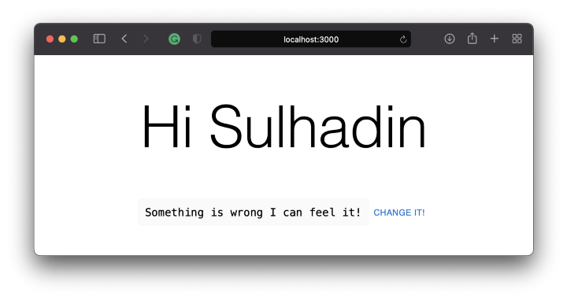
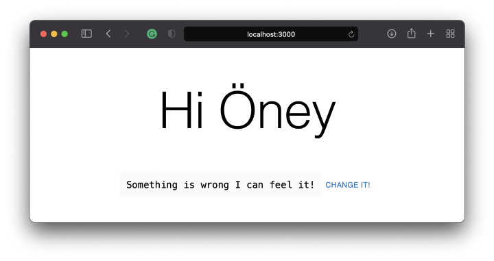

Eğer uzun süredir React kullanıyorsanız, State Manager kullanmış olmalısınız. Birçoğumuz için Redux, vaat ettiği kadar iyi olduğu için fiili bir durum yöneticisi olarak görülüyordu. Ancak sorun şuydu ki Redux'u kullanmaya başlamak için çok fazla ortak koda ihtiyaç vardı ve en basit uygulamalar bile dik bir öğrenme eğrisine sahipti. Bu şikayetler geliştirici topluluğu tarafından yüksek sesle dile getiriliyordu. Sonunda, Redux'un arkasındaki ekip de bunları fark etti. Redux Toolkit'e Giriş

> Verimli Redux geliştirme için, güzel şeyler içeren araç seti

---

## Biraz da onlar ne demiş öyle başlayalım...
Redux Toolkit aslında Redux ile ilgili üç yaygın endişeyi gidermeye yardımcı olmak için oluşturuldu:

* "Redux store'u yapılandırmak çok karmaşık"
* "Redux'un işe yarar bir şey yapmasını sağlamak için çok sayıda paket eklemem gerekiyor"
* "Redux çok fazla şablon kod gerektiriyor"

Bu noktalar göz önüne alındığında, yeni State Management büyük bir kurtarıcı olarak karşımıza çıkıyor.

Uzun lafın kısası, bu yazıda [Redux-toolkit](https://redux-toolkit.js.org/) ve [Typescript](https://www.typescriptlang.org/) kullanarak küçük bir [Next.js](/https://nextjs.org/) uygulaması ile tanışacaksınız. Ana odak noktası Redux-toolkit, klasör yapısı ve render performansı olacaktır. Bu redux-toolkit uygulaması hem istemci tarafı hem de sunucu tarafı render işlemlerinde çalışacaktır.

## Hazırlık aşaması
Bir projeyi çalıştırmak birkaç cli komutu yazmak kadar basittir.

* [create-next-app](https://github.com/vercel/next.js/tree/canary/packages/create-next-app) paketini `npm` veya `yarn` ile çalıştırın.
* Kurulum tamamlandıktan sonra, uygulamanızı aşağıdaki komutları kullanarak çalıştırabilirsiniz:

```bash
cd nextjs-blog

yarn run dev
#or
npm run dev
```

Tüm işlemler tamamlandığında, uygulamanın [http://localhost:3000/](http://localhost:3000/) üzerinde çalıştığını görebilmeniz gerekir

## Klasör Yapısı - Ivır Zıvır!
Klasör standardı genel olarak ana sorunlardan biridir. En az bir projede çalıştıysanız, bu dosyayı nereye koyacağınız sorunlarına aşina olabilirsiniz. Klasör yapısı için en iyi uygulama yoktur, ancak proje büyüdükçe şekil alır. Yine de kullandığınız javascript `framework`üne göre değişir.

Başlangıçta, klasör yapınızı incelediğinizde aşağıdaki gibi bir yapı göreceksiniz;

```
.
┣ 📂 node_modules
┣ 📂 public
┣ 📂 src
┃ ┗ 📂 pages
┃    ┣ 📂 api
┃    ┃  ┗ 📄 hello.ts
┃    ┣ 📄 _app.tsx
┃    ┣ 📄 _document.tsx
┃    ┗ 📄 index.tsx
┣ 📄 .gitignore
┣ 📄 yarn.lock
┗ 📄 package.json
```

İlk hamle klasör standartları oluşturmaktır. Bu standartları oluşturmanın amacı; geliştiricilerin farklı isimler ve konumlar uygulamasının önüne geçmektir. Böylece geliştiricilerin hepimizin aynı sayfada olmasını ve aynı yöne bakmasını sağlamaktır.

İşte örneğimizdeki ihtiyaçlarımızı karşılayabileceğini düşündüğümüz bir öneri klasör yapısı.

```
.
┣ 📂 node_modules
┣ 📂 public
┣ 📂 src
┃ ┣ 📂 pages
┃ ┃  ┣ 📂 api
┃ ┃  ┣ 📄 _app.tsx
┃ ┃  ┣ 📄 _document.tsx
┃ ┃  ┗ 📄 index.tsx
┃ ┣ 📂 store
┃ ┃  ┗ 📂 slices
┃ ┣ 📂 styles
┃ ┃  ┗ 📄 globals.css
┃ ┣ 📂 ui
┃ ┃  ┣ 📂 components
┃ ┃  ┗ 📂 home
┣ 📄 .gitignore
┣ 📄 yarn.lock
┗ 📄 package.json
```

* `pages` ve `ui` bağlantılı olma eğilimindedir.
* Sayfalar `pages` klasörüne eklendikçe `ui` klasörüne de klasörler eklenecektir. (Örneğin, bileşenler, yardımcılar gibi `pages/index.tsx` içinde kullanılan her şey `ui/home` klasörü altına konacaktır).
* `ui/components` paylaşılan bileşenleri içerecektir.

Yazının devamında, `UserCard.tsx`, `store.ts`, `userSlice.ts` oluşturacağız, böylece klasör yapımız aşağıdaki gibi bir şey olacak.

```
.
┣ 📂 node_modules
┣ 📂 public
┣ 📂 src
┃ ┣ 📂 pages
┃ ┃  ┣ 📂 api
┃ ┃  ┣ 📄 _app.tsx
┃ ┃  ┣ 📄 _document.tsx
┃ ┃  ┗ 📄 index.tsx
┃ ┣ 📂 store
┃ ┃  ┣ 📂 slices
┃ ┃  ┃  ┗ 📄 userSlice.ts
┃ ┃  ┗ 📄 store.ts
┃ ┗ 📂 styles
┃ ┃  ┗ 📄 globals.css
┃ ┣ 📂 ui
┃ ┃  ┣ 📂 components
┃ ┃  ┗ 📂 Home
┃ ┃     ┗ 📄 UserCard.tsx
┣ 📄 .gitignore
┣ 📄 yarn.lock
┗ 📄 package.json
```

## Redux Toolkit
Redux Toolkit bir NPM paketi olarak mevcuttur.

```bash
# NPM
npm install @reduxjs/toolkit
# Yarn
yarn add @reduxjs/toolkit
```

Paketi projenize ekledikten sonra, slice ve store'u yapılandırmaya başlayabiliriz.

Basit bir `store/slices/userSlice.ts` dosyası oluşturalım.

```typescript
import { createSlice, Draft, PayloadAction } from '@reduxjs/toolkit';

export interface UserState {
  email: string;
  name: string;
}

/**
 * Default state object with initial values.
 */
const initialState: UserState = {
  name: 'Sulhadin',
  email: 'sulhadin@gmail.com',
} as const;

/**
 * Create a slice as a reducer containing actions.
 *
 * In this example actions are included in the slice. It is fine and can be
 * changed based on your needs.
 */
export const userSlice = createSlice({
  name: 'user',
  initialState,
  reducers: {
    setName: (
      state: Draft<typeof initialState>,
      action: PayloadAction<typeof initialState.name>
    ) => {
      state.name = action.payload;
    },
    setEmail: (
      state: Draft<typeof initialState>,
      action: PayloadAction<typeof initialState.email>
    ) => {
      state.email = action.payload;
    },
  },
});

// A small helper of user state for `useSelector` function.
export const getUserState = (state: { user: UserState }) => state.user;

// Exports all actions
export const { setName, setEmail } = userSlice.actions;

export default userSlice.reducer;
```

Ardından, store'u `store/store.ts` olarak oluşturmanın zamanı geldi

```typescript
import { configureStore } from '@reduxjs/toolkit';
import userSlice from './slices/userSlice';
import {
  useDispatch as useDispatchBase,
  useSelector as useSelectorBase,
} from 'react-redux';

/**
 * Creates a store and includes all the slices as reducers.
 */
export const store = configureStore({
  reducer: {
    user: userSlice,
  },
});

// Infer the `RootState` and `AppDispatch` types from the store itself
export type RootState = ReturnType<typeof store.getState>;

// Inferred type: { users: UsersState}
type AppDispatch = typeof store.dispatch;

// Since we use typescript, lets utilize `useDispatch`
export const useDispatch = () => useDispatchBase<AppDispatch>();

// And utilize `useSelector`
export const useSelector = <TSelected = unknown>(
  selector: (state: RootState) => TSelected
): TSelected => useSelectorBase<RootState, TSelected>(selector);
```

Son yapılandırma, ana uygulamamızla yepyeni küresel durumumuzla entegre edilecek ve gitmeye hazırız.

```tsx
import '../styles/globals.css';
import type { AppProps } from 'next/app';
import { Provider } from 'react-redux';
import { store } from '../store/store';

function MyApp({ Component, pageProps }: AppProps) {
  return (
    <Provider store={store}>
      <Component {...pageProps} />
    </Provider>
  );
}

export default MyApp;
```

Cool! Now we have set a slice in the store. You need to go to `index.ts` and create a view so that you can use the actions and selectors you created with `userSlice`. this index.ts has already been created as `src/pages/index.tsx`. So, we are going to add a simple user card that is being called from index.tsx. Let’s create the user card as `ui/home/UserCard.tsx`.

Harika! Şimdi mağazada bir dilim belirledik. `userSlice` ile oluşturduğunuz eylemleri ve seçicileri kullanabilmeniz için `index.ts` adresine gitmeniz ve bir görünüm oluşturmanız gerekir. bu `index.ts` zaten `src/pages/index.tsx` olarak oluşturulmuştur. Bu yüzden, `index.tsx`den çağrılan basit bir kullanıcı kartı ekleyeceğiz. Kullanıcı kartını `ui/home/UserCard.tsx` olarak oluşturalım.

```tsx
import React, { memo } from 'react';
import { Button, Typography } from '@mui/material';

import { useDispatch, useSelector } from '../../store/store';
import { getUserState, setEmail, setName } from '../../store/slices/userSlice';
import styles from '../../styles/Home.module.css';

/**
 * A simple User card that pulls user info from redux-toolkit and displays it.
 * @constructor
 */
function UserCard() {
  const dispatch = useDispatch();
  const { name, email } = useSelector(getUserState);

  const onClick = () => {
    setTimeout(() => {
      dispatch(setName('Öney'));
      // dispatch(setEmail('sulhadin@hotmail.com'));
    }, 2000);
  };

  console.log('user info', name, email);
  return (
    <>
      <Typography variant="h1" component="h2">
        Hi <>{name}</>
      </Typography>

      <p className={styles.description}>
        <code className={styles.code}>Something is wrong I can feel it!</code>
        <Button onClick={onClick}>Change it!</Button>
      </p>
    </>
  );
}

export default memo(UserCard);
```

> Burada örnekte [material ui](https://mui.com/) kullandık ama bahsetmeye değmez. İstediğinizi seçebilir ya da hiçbir şey kullanmayabilirsiniz.

Uygulamamız neredeyse tamamlandı. Şu andan itibaren, şimdiye kadar ne yaptığımıza ve madalyonun diğer yüzüne odaklanacağız.

Temel olarak, bir başlangıç durumumuz var ve bu durum bileşen ilk kez render edildiğinde render ediliyor. Sonra, `Change it` adında bir düğme görüyorsunuz! . Basitçe yaptığı şey, basıldıktan birkaç saniye sonra yeni durumu kullanıcının adına göndermektir. Ardından, `useSelector` değişen durumu tanır ve bileşenin oluşturulmasını tetikler falan filan... Her şeyi biliyoruz!

Madalyonun diğer yüzü ise `UserCard.tsx:19`un bileşen üzerindeki etkisi olacaktır. Bu satırı fark ettiğinizden ve unutulduğunu düşündüğünüzden oldukça eminim. Hayır :) Bilerek bırakılmıştır.

Şimdiye kadar her şeyi kaydedin ve bir deneyin!



Bir şeylerin yanlış olduğunu hissettiğinizde ve içinizde bunu değiştirmeniz gerektiğini söyleyen bir his büyüdüğünde! Evet, tereddüt etmeyin, yapın!


> `Change It!` düğmesine bastıktan sonra

Burada anormal bir şey yok, her şey beklendiği gibi çalışıyor.

Bir sonraki yazıda, **React Profiler**'ın yaptığı şeyleri gözlemleyeceğiz.


